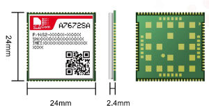

# MQTT Communication Library for A7672SA (SIMCOM) and ESP32 (Espressif)

## Description

This C++ library provides an easy-to-use interface for establishing MQTT communication between the A7672SA module from SIMCOM and the ESP32 board from Espressif. The library simplifies the process of setting up an MQTT client on both devices, enabling seamless data exchange over the MQTT protocol.

## Features

- Simple and lightweight MQTT communication between A7672SA and ESP32.
- Easy integration with existing projects.
- Supports both subscribe and publish functionalities.
- Adjustable QoS (Quality of Service) levels for message delivery.
- Customizable MQTT broker configurations.

## Requirements

- A7672SA module from SIMCOM.
- ESP32 board from Espressif.
- PlatformIO IDE for building and uploading the library.
- Internet connectivity for MQTT communication with a broker.

## Installation

1. Clone the repository: `git clone https://github.com/giovannirosso/MQTT_A7672SA.git`
2. In your PlatformIO project, include the library:
   - Add `#include <MQTT_A7672SA.h>` to your main sketch.
